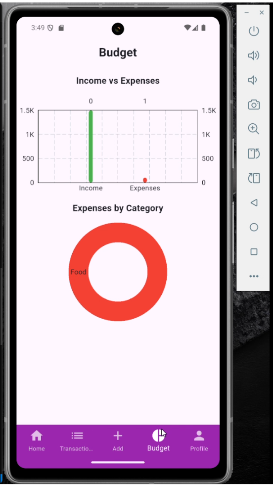

# 💰 CipherX - Expense Tracker Flutter App

## 📖 Introduction

CipherX is a Flutter-based expense tracking application designed to help users manage their finances effectively. With features like Total Income/Expense, All Transactions, Adding transaction, budget insights, and data visualization, CipherX provides a seamless experience for users to stay on top of their financial goals.

**Screen Recording**: Have a look to CiperX

*https://drive.google.com/file/d/19GHPEOhqG0548l6hzBvN8DJS4reVEx3y/view?usp=sharing*

---

## 🛠️ About This Project

CipherX integrates **Cloud Firestore** and **Hive** for real-time and offline transaction management. It offers a user-friendly interface and includes screens:

1. **Splash Screen**: Entry point of the app with branding and login status check.
2. **Login Screen**: Login with email/password or Google authentication.
3. **Signup Screen**: Create an account with email/password or Google authentication.
4. **Forgot Password Screen**: Recover account access via email.
5. **Home Screen**: Financial overview with income, expenses, and transactions summary.
6. **Transactions Screen**: View all transactions with search and filter options.
7. **Add Transaction Screen**: Add income or expense entries with detailed information.
8. **Budget Screen**: Track budgets with different categories like income vs expense and expense vs category.
9. **Profile Screen**: Manage user settings, export data, toggle dark mode, and logout.

---

## 📱 Screens Overview

### 1. 🏠 Splash Screen

- **Goal**: The splash screen serves as the entry point of the app, providing a brief introduction to CipherX while ensuring a smooth transition into the app.
- **Features**:
  - Displays the app logo and branding.
  - Checks the user's login status using `SharedPreferences`.
  - Automatically navigates to the login screen if the user is not logged in or directly to the home screen if the user is already authenticated.

**Screenshot**:  

---

### 2. 🏠 Login Screen

- **Goal**: Allow users to securely log in to their accounts using their email and password or Google authentication.
- **Features**:
  - Simple and intuitive UI for entering email and password.
  - Option to log in using Google for faster access.
  - Error handling for invalid credentials or network issues.
  - Redirects to the home screen upon successful login.

**Screenshot**:  

---

### 3. 🏠 Signup Screen

- **Goal**: Enable new users to create an account and start using the app.
- **Features**:
  - Form for entering email, password, and confirming the password.
  - Option to sign up using Google for convenience.
  - Validates user input to ensure strong passwords and valid email addresses.
  - Stores user credentials securely in Firebase Authentication.

**Screenshot**:  

---

### 4. 🏠 Forgot Password Screen

- **Goal**: Help users recover access to their accounts if they forget their password.
- **Features**:
  - Input field for entering the registered email address.
  - Sends a password reset link to the user's email via Firebase Authentication.
  - Displays confirmation messages for successful email dispatch or error messages for invalid emails.

**Screenshot**:  

---

### 5. 🏠 Home Screen

- **Goal**: Display financial overview and recent transactions.
- **Features**:
  - Total Income and Expense details
  - Recent Transaactions

**Screenshot**:  

---

### 6. 📋 Transactions Screen

- **Goal**: Show all transactions with search and filter options.
- **Features**:
  - Search bar for real-time filtering.
  - Dropdown filters for category, type (income/expense),.

**Screenshot**:  

---

### 7. ➕ Add Transaction Screen

- **Goal**: Allow users to add new income or expense entries.
- **Features**:
  - Form with fields: amount, category, description, and type.
  - Save transactions to Firestore and Hive.

**Screenshot**:  

---

### 8. 📊 Budget Screen

- **Goal**: Manage and visualize budgets.
- **Features**:
  - Bar graph for income vs. expense.
  - Pie Charts for expenses by category.

**Screenshot**:  

---

### 9. 👤 Profile Screen

- **Goal**: Manage user settings and actions.
- **Features**:
  - Display user info (email).
  - Toggle dark mode.
  - Export data.
  - Logout functionality.

**Screenshot**:  

### 9. 👤 Real Time Firebase Update

- **Goal**: Ensure seamless synchronization of user data across devices and provide real-time updates for transactions and user actions.
- **Features**:
  - **Firebase Authentication**: Manages user authentication securely, allowing users to log in and access their data from any device.
  - **Cloud Firestore**: Provides real-time database updates for transactions, ensuring that changes made on one device are instantly reflected on others.
  - **Offline Support**: Uses Firestore's offline capabilities to allow users to view and modify data even without an internet connection. Changes are synced automatically when the connection is restored.

**Screenshots**:  
  

---

## 📦 Dependencies

The project uses the following dependencies:

- **Core**:

  - `flutter`: UI framework.
  - `firebase_core`: Firebase initialization.
  - `cloud_firestore`: Firestore database.
  - `firebase_auth`: User authentication.
  - `hive` & `hive_flutter`: Local storage.
  - `shared_preferences`: Persistent storage for user preferences.

- **State Management**:

  - `provider`: State management.
  - `get`: Navigation and reactive state management.

- **UI Enhancements**:
  - `fl_chart`: Charts for data visualization.
  - `intl`: Date and number formatting.

---

## 🔄 User Flow

1. **Splash Screen**:

   - Checks if the user is logged in using `SharedPreferences`.
   - Navigates to the login screen if not logged in.

2. **Login/Signup**:

   - Authenticate users using Firebase Authentication.

3. **Home Screen**:

   - Displays financial summary and recent transactions.
   - Syncs transactions from Firestore to Hive for offline access.

4. **Transactions Screen**:

   - Lists all transactions with search and filter options.

5. **Add Transaction**:

   - Allows users to add income or expense entries.
   - Updates Firestore and Hive.

6. **Budget Screen**:

   - Visualizes income vs. expenses and category-wise spending.
   - Alerts users if spending exceeds the budget.

7. **Profile Screen**:
   - Provides options to toggle dark mode, export data, and logout.

---

## 🚀 Features

- **Cloud Firestore Integration**:

  - Real-time sync of transactions.
  - Offline access using Hive.

- **Expense Insights Dashboard**:

  - Visualize spending with Pie/Bar charts.

- **Export Data**:

  - Export transactions.

- **Dark Mode**:

  - Toggle between light and dark themes.

- **Session Persistence**:
  - Auto-login using `SharedPreferences`.

---

## 🛠️ Next Steps

### Implementation Checklist:

1. **Firestore Service**:

   - CRUD operations for transactions.

2. **Transaction Provider**:

   - Manage state and sync between Firestore and Hive.

3. **UI Enhancements**:

   - Add animations and improve responsiveness.

4. **Testing**:
   - Write unit and integration tests for critical features.

---

## 📜 License

This project is for educational purposes only. All rights reserved.

---

## 💝 Made With Love - Mohammed Faizan 💝
